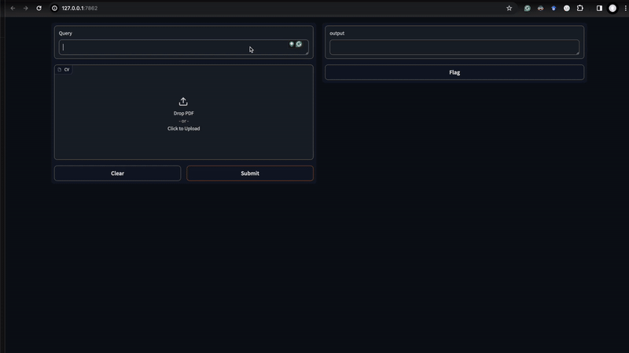

# RAG-based Job Search Assistant

This project aims to help your job search with GenAI!

Have you done a job search and ended up with too many jobs look like a good next step and didn't know where to start? This project seeks to assist and be an AI guidance for your job search.

## Demo



The Gradio demo can be run by

```bash
python src/gradio_demo.py
```

## Architecture Overview

Here is the most simplistic RAG-based Job Search Assistant architecture overview.
You will need to build a vector store with job posts and then you upload your CV then can query a question regarding your job search. Also, there are several LLM evaluations before returning the response to make sure that the response is faithful, helpful and relevant to the given query.


## Use case examples

Here are a few use case ideas how you can leverage this job search assistant but not limited to. Use your creativity to take advantage of this assistant.

- Pick up $n$ jobs that are most relevant to you
- Tailor your CV to the job you want to apply
- Help you to write a statement of purpose
- Once you found a job that you are interested in, you can see which required skills are matched to the job (see the example output below.)

>Query:
>
>"Can you itemise both the requirements of Job ID: 3833524246 and skill sets of my CV and tell me which requirements and my skill sets matched and missing."
>
>Response:
>
>"Your CV indicates that you are a Google and IBM certified Data Scientist with 8+ years of experience in driving quantifiable business growth and revenue in the retail and e-commerce sectors. It also mentions proficiency in Python, Java, and analytical skills. However, your CV does not explicitly mention experience with frameworks like Spark, DASK, Tensorflow, or PyTorch, which are required for the job.
>
>Matched requirements:
>
>1. 8+ years of experience as a data scientist
>2. Fluent in Python
>3. Excellent analytical skills
>4. Superior communication and presentation skills
>5. Used to start-up environments
>6. Social competence and a team player
>7. High energy and ambitious
>
>Missing requirements:
>
>1. Experience with Java and bashing scripts
>2. Mastery in at least one framework for BigData and one framework for Deep Learning
>3. Agile mindset
>
>Source nodes used:
>
>- Job ID: 3833524246
>- CV: Doc ID: 5ebaa1a2-7d1d-49e7-87b4-939d35664b5e"

## How to use

There are 3 components in this project so far - It will source the job post data, build a vector storage and start querying questions regarding your job search. The usage of each components can be found below:

### 1. Scrape the job posts

This can be done by running `src/job_scraper.py`. This script will use `linkedin_jobs_scraper` package to scrape the job posts in LinkedIn. You can configure the scraper to suit your job title, location, full/part time, etc in the file. The example is using job title: Data scientist and location: United Kingdom.

### 2. Build a vector storage

This can be done by running `src/store_data.py`. This process takes the csv file that contains job posts and create a vector store in `storage` directory.

### 3. Start querying

This can be done by running `src/main.py`. You can upload your CV in `input_cv` directory and can be consumed in RAG.

Note: The LLM this demo is using is Open AI GPT-3.5 turbo, so it will require to set `OPENAI_API_KEY` environmental variable

## Limitations

- You will get a helpful response only when there are several job posts that are relevant to you, in other words, the quality of the response depends on the data you have in the vector store
- This demo does not have a fancy UI, so you will need to run the script `main.py`
- As mentioned above, the LLMs that employed in this demos are Open AI GPT-3.5 turbo, so it is not fine-tuned
- The architecture of RAG in this demo is very simplistic (Naive RAG + LLM evaluation), so there are so much space to improve the quality of the response
